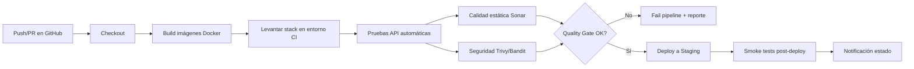

# AA2 – ABP: Proyecto Integrador

## Construcción de un Pipeline para un Proyecto de Software

---

## Portada

**Título del proyecto:** AA2 – ABP: Proyecto Integrador – Construcción de un Pipeline para un Proyecto de Software  
**Nombre completo del estudiante:** **************\_\_\_\_**************  
**Nombre del curso:** **************\_\_\_\_**************  
**Fecha de entrega:** \_**\_ / \_\_** / **\_\_**

---

## Introducción

El sistema seleccionado para este proyecto corresponde a una solución de **gestión de pedidos y reservas para un restaurante**, compuesta por varios servicios desacoplados: autenticación de usuarios, reservas de mesas, gestión de pedidos y una interfaz frontend web para interacción con el usuario final.

En escenarios de desarrollo colaborativo, una arquitectura distribuida de este tipo requiere mecanismos de integración robustos para evitar regresiones, inconsistencias entre módulos y errores de despliegue. Por esta razón, la implementación de un pipeline **CI/CD (Integración Continua / Entrega Continua)** es esencial para automatizar validaciones técnicas, asegurar calidad y habilitar entregas frecuentes de manera confiable.

Este documento presenta el diseño, documentación y simulación de un pipeline CI/CD para el sistema de restaurante, incluyendo etapas de compilación/empaquetado, pruebas funcionales, validaciones de calidad y seguridad, así como lineamientos de escalamiento a entornos reales de producción.

---

## Desarrollo

## 1. Análisis del Sistema

### 1.1 Funcionalidades principales del sistema de restaurante

El sistema implementa funcionalidades clave del dominio:

- **Autenticación de usuarios (auth-service)**
  - Registro de usuarios
  - Inicio de sesión
  - Emisión de token para autenticación

- **Gestión de reservas (reservations-service)**
  - Consulta de disponibilidad de mesas
  - Creación de reserva
  - Consulta de reserva por identificador
  - Cancelación de reserva

- **Gestión de pedidos (orders-service)**
  - Consulta de menú
  - Creación de pedido
  - Confirmación de pedido
  - Consulta de pedido por identificador

- **Frontend web (frontend)**
  - Formularios para consumir las operaciones anteriores mediante llamadas HTTP a los microservicios

### 1.2 Módulos incluidos en el pipeline

Se incluyen dentro del pipeline los siguientes módulos:

1. `auth-service`
2. `reservations-service`
3. `orders-service`
4. `frontend`
5. Definiciones de orquestación (`docker-compose.yml`)
6. Configuración de calidad estática y documentación de soporte (`sonar-project.properties`, carpeta `docs/`)

### 1.3 Puntos críticos a automatizar

Los puntos críticos identificados para automatización son:

- **Integridad de dependencias por servicio** (build reproducible)
- **Pruebas de salud y disponibilidad** por endpoint
- **Validación funcional mínima de operaciones críticas** (create/read/update/cancel/confirm)
- **Validación de CORS** para interoperabilidad frontend-backend
- **Estrategia de fail-fast** ante errores de pruebas
- **Evidencias trazables** de ejecución (logs y reportes)
- **Preparación para despliegues controlados** (staging)

---

## 2. Diseño del Pipeline CI/CD

### 2.1 Etapas principales del pipeline

El pipeline propuesto sigue esta secuencia:

1. **Checkout**
2. **Build**
3. **Test**
4. **Quality & Security**
5. **Package/Publish**
6. **Deploy Staging**
7. **Post-Deploy Verification**
8. **Notification**

### 2.2 Herramientas por etapa

| Etapa                      | Herramienta principal   | Propósito                                   |
| -------------------------- | ----------------------- | ------------------------------------------- |
| Control de versiones       | Git + GitHub            | Versionado, ramas, PRs                      |
| Orquestación CI/CD         | GitHub Actions          | Automatización de jobs                      |
| Empaquetado                | Docker                  | Imágenes por microservicio                  |
| Orquestación local/staging | Docker Compose          | Levante del sistema completo                |
| Pruebas API                | curl (scripts) / pytest | Verificación funcional                      |
| Calidad estática           | SonarQube/SonarCloud    | Detección de issues y code smells           |
| Seguridad                  | Trivy + Bandit          | Escaneo de vulnerabilidades e inseguridades |
| Observabilidad básica      | Logs de contenedor      | Evidencia de ejecución                      |

### 2.3 Diagrama del pipeline (Mermaid)



### 2.4 Ejemplo de configuración YAML (simulado)

```yaml
name: ci-cd-restaurant-pipeline

on:
  push:
    branches: ["main", "develop"]
  pull_request:
    branches: ["main"]

jobs:
  build-test-quality:
    runs-on: ubuntu-latest
    steps:
      - name: Checkout
        uses: actions/checkout@v4

      - name: Build containers
        run: docker compose build

      - name: Start services
        run: docker compose up -d

      - name: Health checks
        run: |
          curl -f http://localhost:5001/health
          curl -f http://localhost:5002/health
          curl -f http://localhost:5003/health
          curl -f http://localhost:8080

      - name: API functional tests
        run: |
          # Auth
          echo '{"name":"QA User","email":"qa@example.com","password":"123456"}' > auth_register.json
          curl -f -X POST http://localhost:5001/api/auth/register -H "Content-Type: application/json" --data @auth_register.json

          echo '{"email":"qa@example.com","password":"123456"}' > auth_login.json
          curl -f -X POST http://localhost:5001/api/auth/login -H "Content-Type: application/json" --data @auth_login.json

          # Reservations
          curl -f "http://localhost:5002/api/reservations/availability?date=2026-05-25&time=19:00&party_size=2"

          echo '{"customer_id":1,"date":"2026-05-25","time":"19:00","party_size":2}' > reservation_create.json
          curl -f -X POST http://localhost:5002/api/reservations/ -H "Content-Type: application/json" --data @reservation_create.json

          # Orders
          curl -f http://localhost:5003/api/menu/
          echo '{"customer_id":1,"items":[{"product_id":"P001","quantity":1}]}' > order_create.json
          curl -f -X POST http://localhost:5003/api/orders/ -H "Content-Type: application/json" --data @order_create.json

      - name: Static analysis
        run: sonar-scanner

      - name: Security scan
        run: |
          trivy image restaurant-pipeline-auth-service:latest
          trivy image restaurant-pipeline-reservations-service:latest
          trivy image restaurant-pipeline-orders-service:latest
          trivy image restaurant-pipeline-frontend:latest

      - name: Stop services
        if: always()
        run: docker compose down
```

---

## 3. Simulación de ejecución del pipeline

### 3.1 Ejecución paso a paso

A continuación se describe la simulación real ejecutada en entorno local con Docker Compose:

1. **Build y arranque de servicios**
   - Comando:
     ```bash
     docker compose up --build -d
     ```
   - Resultado esperado: imágenes construidas y contenedores en estado `Up`.
   - Resultado observado: servicios levantados correctamente (frontend, auth, reservations, orders, postgres).

2. **Verificación de estado**
   - Comando:
     ```bash
     docker compose ps
     ```
   - Resultado esperado: todos los contenedores en `Up`, postgres en `healthy`.
   - Resultado observado: estado conforme a lo esperado.

3. **Health checks**
   - Comandos:
     ```bash
     curl -i http://localhost:5001/health
     curl -i http://localhost:5002/health
     curl -i http://localhost:5003/health
     curl -i http://localhost:8080
     ```
   - Resultado observado: respuestas `200 OK`.

4. **Pruebas funcionales API (happy path y error path)**
   - Auth:
     - Registro `201`
     - Login `200`
     - Login inválido `401`
   - Reservations:
     - Disponibilidad `200`
     - Crear reserva `201`
     - Consultar reserva `200`
     - Cancelar reserva `200`
     - Payload incompleto `400`
     - Reserva inexistente `404`
   - Orders:
     - Consultar menú `200`
     - Crear pedido `201`
     - Confirmar pedido `200`
     - Consultar pedido `200`
     - Producto inválido `404`
     - Pedido inexistente `404`

### 3.2 Simulación de fallos y medidas de corrección

#### Falla 1: Error de creación desde frontend (`Failed to fetch`)

- **Síntoma:** operaciones de creación fallaban desde UI.
- **Causa raíz:** políticas CORS no habilitadas en los servicios Flask.
- **Corrección aplicada:**
  - Se añadió `flask-cors==5.0.0` en:
    - `auth-service/requirements.txt`
    - `reservations-service/requirements.txt`
    - `orders-service/requirements.txt`
  - Se habilitó CORS en `app/main.py` de cada microservicio:
    ```python
    from flask_cors import CORS
    CORS(app, resources={r"/api/*": {"origins": "*"}})
    ```
- **Validación posterior:** preflight `OPTIONS` y peticiones reales `POST/PUT` con respuestas correctas.

#### Falla 2: `400 Bad Request` en pruebas con curl (PowerShell)

- **Síntoma:** peticiones con JSON devolvían 400 y errores de parseo.
- **Causa raíz:** escaping incorrecto del JSON en línea de comandos.
- **Corrección aplicada:** uso de archivos de payload:
  ```bash
  curl.exe -X POST ... --data "@payload.json"
  ```
- **Validación posterior:** registro exitoso `201` y flujo completo operativo.

### 3.3 Evidencias (comandos y resultados)

**Ejemplos de comandos ejecutados**

```bash
docker compose up --build -d
docker compose ps
curl.exe -i http://localhost:5003/api/menu/
curl.exe -i -X POST http://localhost:5001/api/auth/register -H "Content-Type: application/json" --data "@auth_register.json"
curl.exe -i -X POST http://localhost:5002/api/reservations/ -H "Content-Type: application/json" --data "@reservation_create.json"
curl.exe -i -X POST http://localhost:5003/api/orders/ -H "Content-Type: application/json" --data "@order_create.json"
```

**Resultados observados clave**

- `GET /api/menu/` → `200 OK`
- `POST /api/auth/register` → `201 CREATED`
- `POST /api/reservations/` → `201 CREATED`
- `POST /api/orders/` → `201 CREATED`

---

## 4. Validación de calidad y seguridad

### 4.1 Requisitos no funcionales validados dentro del pipeline

1. **Disponibilidad**
   - Validada mediante health checks automáticos por servicio.
   - Criterio: endpoints de salud deben responder `200` antes de continuar.

2. **Seguridad**
   - Escaneo de dependencias e imágenes.
   - Validación de exposición de vulnerabilidades en contenedores.

3. **Rendimiento básico y estabilidad**
   - Smoke tests y validación de respuesta funcional continua tras despliegue.
   - Recomendado complementar con pruebas de carga.

### 4.2 Herramientas/técnicas integradas (mínimo dos)

- **SonarQube / SonarCloud**
  - Análisis estático de calidad de código
  - Detección de code smells, duplicación y deuda técnica

- **Trivy**
  - Escaneo de vulnerabilidades en imágenes Docker y dependencias

- **Bandit (sugerido para Python)**
  - Detección de patrones inseguros en código fuente Python

- **OWASP ZAP (sugerido para etapa avanzada)**
  - Pruebas dinámicas de seguridad para APIs y frontend

---

## 5. Buenas prácticas y automatización sugerida

### 5.1 Buenas prácticas implementadas

- Pipeline modular por etapas (build, test, quality, deploy)
- Validaciones automáticas previas al despliegue
- Pruebas API reproducibles con payloads versionables
- Contenerización por microservicio para consistencia de entornos
- Estrategia de corrección basada en evidencia (logs + respuestas HTTP)
- Separación de responsabilidades entre servicios

### 5.2 Estrategias para escalar a producción y trabajo colaborativo

1. **Estrategia de ramas**
   - `feature/*` → `develop` → `main`
   - Pull Request obligatorio con revisión de código

2. **Ambientes separados**
   - `dev`, `staging`, `prod` con secretos por entorno

3. **Despliegue progresivo**
   - Blue/Green o Canary para reducir riesgo de impacto

4. **Gates obligatorios antes de merge**
   - Cobertura mínima de pruebas
   - Sonar Quality Gate aprobado
   - Escaneo de seguridad sin vulnerabilidades críticas

5. **Observabilidad**
   - Centralización de logs y métricas (ELK/Prometheus/Grafana)
   - Alertas automáticas sobre degradación

---

## Matriz de cumplimiento de la rúbrica

| Criterio                            | Evidencia incluida en este documento                          |
| ----------------------------------- | ------------------------------------------------------------- |
| Calidad y originalidad del proyecto | Diseño completo y contextualizado al caso real de restaurante |
| Aplicación de conceptos             | Integración CI/CD, Docker, pruebas, calidad y seguridad       |
| Construcción del pipeline           | Etapas claras, secuencia lógica, YAML y diagrama              |
| Redacción y lenguaje                | Documento estructurado, formal y técnico                      |
| Organización y presentación         | Portada, introducción, desarrollo, conclusiones y tablas      |

---

## Conclusiones

El diseño y simulación del pipeline CI/CD para el sistema de restaurante demuestra que la automatización reduce significativamente errores manuales, mejora la trazabilidad técnica y acelera los ciclos de entrega. Las validaciones automáticas de build, pruebas funcionales y controles de calidad/seguridad permiten detectar problemas tempranamente y evitar su propagación a entornos de despliegue.

Durante el desarrollo del proyecto se evidenció que problemas típicos como configuraciones CORS, errores de payload o inconsistencias de consumo entre frontend y backend pueden resolverse de forma eficiente cuando existe un pipeline estructurado con evidencias y gates de calidad.

Como aprendizaje principal, se concluye que CI/CD no solo automatiza tareas: también formaliza una cultura de ingeniería orientada a la calidad continua, la colaboración disciplinada y la entrega confiable de valor al usuario final.

---

## Anexo A – Comandos base para ejecución local

```bash
docker compose up --build -d
docker compose ps
docker compose logs -f
docker compose down
```

---

## Anexo B – Nombre final del archivo entregable

**AA2_Pipeline_SistemaRestaurante.pdf**
