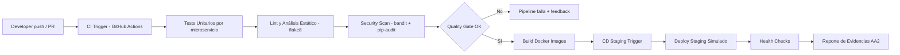

# Diagrama del Pipeline CI/CD - Sistema Restaurante (AA2)

## Vista general (Mermaid)

## Etapas

1. **Integración (CI Trigger)**
   - Se activa con `push` o `pull_request`.
2. **Verificación de calidad**
   - Pruebas unitarias.
   - Linting y análisis estático.
   - Escaneo de seguridad de código y dependencias.
3. **Empaquetado**
   - Build de imágenes Docker para cada servicio.
4. **Entrega continua (CD)**
   - Despliegue a entorno de staging simulado.
   - Validaciones básicas post-despliegue.

## Beneficios

- Detección temprana de errores.
- Menor riesgo en despliegues.
- Evidencia trazable para aseguramiento de calidad.
- Flujo repetible sin intervención manual.
